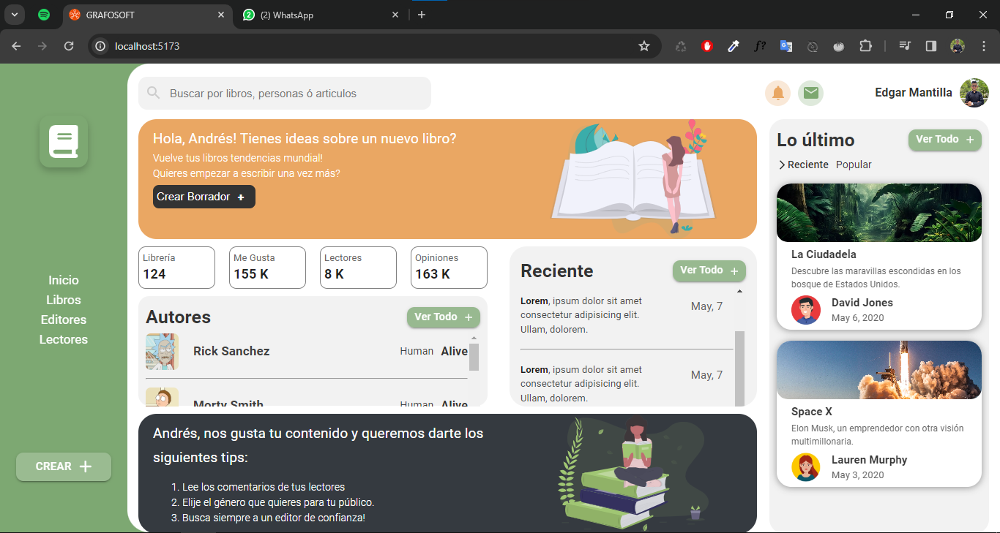
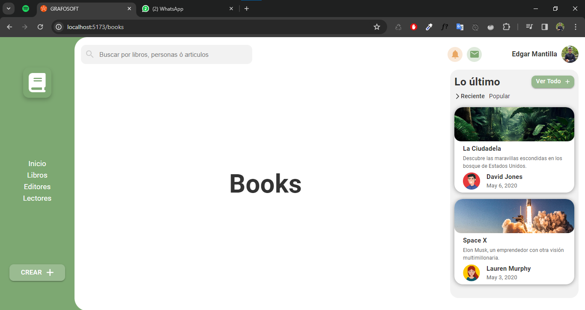
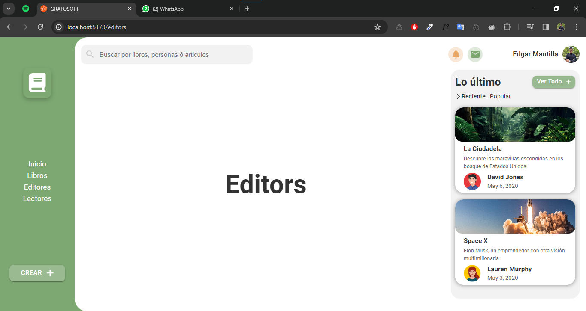
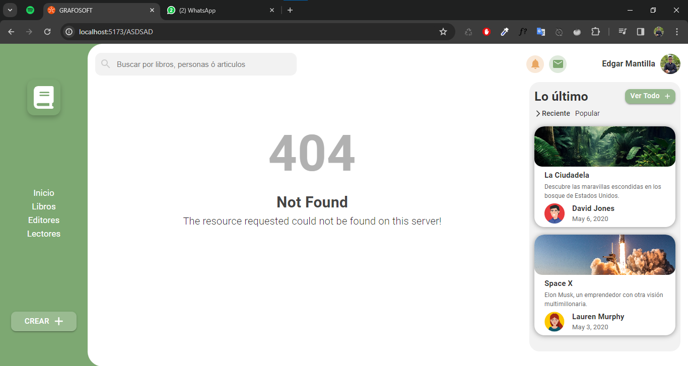

## Solucion prueba tecnica 

#### Importante 

Para la ejecucion del proyecto solo se requiere hacer la instalacion de paquetes con el siguiente comando.

```Js
npm install
```

y por ultimo para correr el proyecto solo seria lo siguiente: 

```Js
npm run dev
```

### Algunas imagenes de la actividad 

;
;
;
;
;
; 